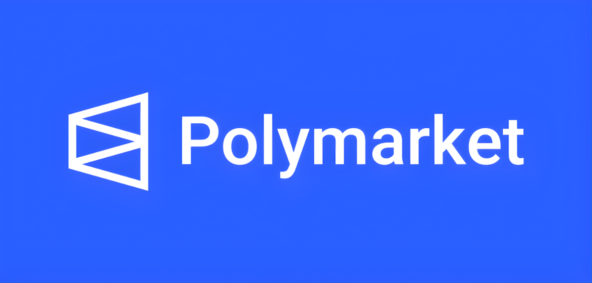

# 🤖 Polymarket Predator: The Ultimate High-Frequency Arbitrage Bot

  

> **Project Concept: Why do you need this right here, right now?**
> "Stop betting on luck — start exploiting mathematical inefficiency."
> While 99% of users treat Polymarket like a standard sportsbook, trying to guess the future, Polymarket Predator views the platform as a Central Limit Order Book (CLOB) decentralized exchange. Every second, due to update latencies between spot markets (Binance, Bybit) and Polymarket, micro-arbitrage windows emerge. Our software is the only HFT terminal that automatically finds and captures this spread. **This is the exact tool that turned $6,556 into $100,000 in 30 days right in front of the entire community.**

  

-----

## ⚙️ Approach Comparison: Why Predator Beats the Market

To understand the difference between a regular user and our bot, check out the table below:

| Feature | Regular Polymarket Player | Polymarket Predator (HFT Bot) |
| :--- | :--- | :--- |
| **Trade Basis** | Intuition, news, predictions | Pure math (EV) and quote latencies |
| **Order Type** | Market Orders (eat up fees) | Limit Orders (Market Making, zero extra fees) |
| **Reaction Speed** | Seconds / Minutes | \< 50 ms (High-Frequency Trading) |
| **Hedging** | None (high risk of loss) | Delta-neutral / Partial Hedge |
| **Profit per Trade** | High (but with 100% loss risk) | Micro-profit (0.5% - 2%), but 100+ trades per hour |

-----

## 💎 Mechanics Breakdown: How Does It Work?

This bot doesn't guess whether "Bitcoin will go up or down." It profits from price discreteness using strict algorithms:

  * ⏱ **5-Minute Market Arbitrage:** The bot scans micro-intervals. If BTC instantly jumps by $50 on Binance, but the outcome price on Polymarket hasn't updated yet, the bot captures this difference in fractions of a second.
  * 🛡 **Delta-Neutral Hedge (Partial Hedge):** The algorithm builds a position so that regardless of the outcome, you break even or stay in the green. The main volume goes toward the dominant trend, while a small fraction goes into an "anti-position" to cover the risks of sudden squeezes.
  * 🧮 **EV-Maximizer:** Every 500 ms, the bot recalculates the Expected Value (EV). If the EV turns negative, the position is instantly adjusted or closed.
  * 🏛 **Market Making Style:** By exclusively using Limit Orders, the bot avoids paying unnecessary platform fees and gains Order Book Priority.

-----

## 🛠 Unique Features of v2.1

  * **Multi-Asset Engine:** Not just BTC anymore\! Earn on the volatility of ETH, SOL, and MATIC simultaneously. The bot automatically distributes liquidity across the most profitable windows.
  * **Anti-Frontrun Shield:** An innovative module that splits your orders and masks them in the order book. Other vulture bots (MEV / Frontrunners) won't be able to cut you off.
  * **Zero-Knowledge Dashboard:** All profit, trade history, and current hedge status are displayed in a user-friendly GUI. You don't need to be a programmer or read a console to see your profits.

-----

## 🤔 Why is it Free and Open Source?

The most frequent question from the community is: *"If the bot prints money, why give it away?"* The answer is purely pragmatic:

1.  **Liquidity Breeds Profit:** The more our bots create order density in the market, the more efficiently our *own* institutional algorithms work on large volumes.
2.  **Community Testing:** We receive bug reports and telemetry from thousands of users, allowing us to refine the core faster than any closed-source development team.
3.  **Ecosystem Building:** We are building the largest software hub for Polymarket. A free bot today means a loyal community for our future premium B2B products tomorrow.

-----

## 🚀 Installation and Quick Start

We've simplified the onboarding to the max. You **do not** need to install Python, libraries, or mess with the command line.

1.  **Download the latest version** for your operating system:
      * [📦 Download for Windows (.exe)](../../releases)
      * [📦 Download for macOS (.dmg)](../../releases)
2.  Run the downloaded file and follow the setup wizard instructions.
3.  Enter your **Polymarket API keys (CLOB)** in the secure settings window.
4.  Select your risk profile: *Conservative* or *Aggressive*.
5.  Click the **"Start Hunting"** button.

-----

## ❓FAQ

**1. What is the minimum deposit required to start?**
While the public $100,000 case study started with $6,556, the bot operates correctly on smaller volumes. We recommend starting with an amount **between $500 and $1,000** so that the partial hedging strategy makes mathematical sense considering Polygon network fees.

**2. Can I lose my entire deposit (liquidation)?**
All trading carries risk. However, thanks to the **Partial Hedge** module, the bot is protected against total fund loss during sharp, unpredictable movements. It programmatically maintains insurance "on the other side" of the market at all times.

**3. Do I need my computer on 24/7?**
For maximum profit — yes. The bot executes an average of 108 trades per hour. We recommend running the `.exe` / `.dmg` on a home PC that doesn't go to sleep, or using a cheap VPS (Virtual Private Server) for uninterrupted operation.

**4. Is it safe to enter API keys into your software?**
Absolutely. The bot runs **entirely locally** on your device. API keys are used exclusively to sign and send orders to Polymarket via their official smart contract. We do not have access to your funds (moreover, the API withdrawal function on Polymarket itself is usually disabled by default).

**5. Which trading pairs are currently the most profitable?**
At the moment, the best stable yield comes from the `BTC/USD 5-min` and `ETH/USD 5-min` pairs. The *Multi-Asset Engine* automatically shifts capital priority to the pair with the highest arbitrage spread in any given second.

**6. Does the bot work in all countries?**
The bot works wherever Polymarket is technically accessible. If access to the platform is restricted by your provider in your region, you will need to set up a proxy or use a VPN (proxy settings can be configured directly in the bot's interface).

**7. How often are updates released?**
We update the core strategy every **1-2 weeks**, rapidly adapting to changes in Polymarket's algorithms and API. The software will automatically check for new versions and prompt you to update upon launch.

-----

## 📄 License & Disclaimer

This project is open-source and distributed under the **MIT License**. You are free to use, modify, and distribute the software, provided that all copies include the original copyright notice and permission notice. See the [LICENSE](https://www.google.com/search?q=LICENSE) file for more details.

⚠️ **Financial Disclaimer:** Polymarket Predator is an experimental trading tool provided "as is" for educational and informational purposes only. High-frequency trading and algorithmic arbitrage involve substantial risk of loss and are not suitable for every investor.

  * The developers do not guarantee any profits or protection from losses.
  * We are not responsible for any direct or indirect financial losses incurred due to software bugs, API latency, network issues, or misconfiguration.
  * Always test your strategies on small amounts and never risk capital you cannot afford to lose.

-----

<i>Built with ❤️ by crypto enthusiasts, for the ultimate traders.</i>

© 2026 Polymarket Predator Team

